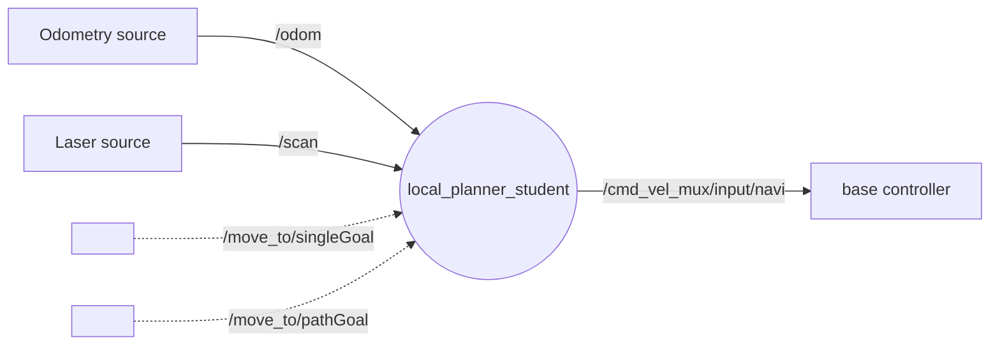
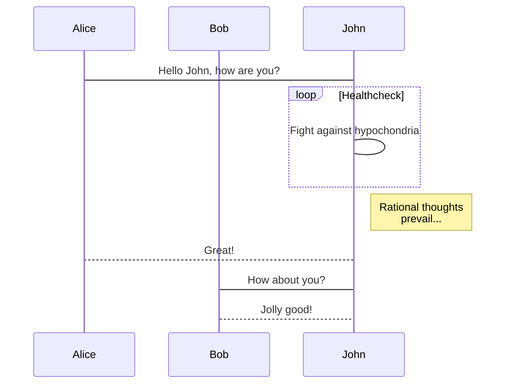

# Navigation de véhicules en milieu urbain

auteurs : Idwes Sough, Arthur Saunier, Younes Abouchi

## Objectifs
Faire naviguer des véhicules (Turtlebot + [Limo](https://global.agilex.ai/products/limo)) dans un environnement urbain (route, feu, piétons, signalisation, ...) en respectant sa réglementation (laisser) 

## Listes des fonctionnalités :

1. [ ] Un conteneur docker contenant :
    1. [ ] Un réseau de neurone YOLO/Darknet
        1. [ ] Reconnaissance panneaux
        2. [ ] Reconnaissance personnage
        3. [ ] Reconnaissance signalisation lumineuse
    2. [ ] ROS node
        1. [ ] Flux vidéo en entrée
        2. [ ] Post-traitement
        3. [ ] Stack navigation
        

## Rendu spécifique au projet :
- 
  - Un réseau de neurone dont les inférences tournent sur GPU:
    - Classe requises :
      - Tous les panneaux fournis (jouets)
      - Tous les personnages fournis (jouets)
      - Signalisation lumineuse (état des  )
  - Un noeud ROS avec :
    - en entrée : un flux vidéo (caméra)
    - un traitement pour définir le déplacement du robot:
      - Réseau de neurone
      - Post-traitement, par exemple l'état du feu (roue, vert, orange)
    - en sortie : à minima une commande en vélocité du robot, mais idéalement un client d'action lié à la couche de navigation du robot 

La solution dockerisée devra pouvoir tourner indépendamment sur un Turtlebot (sur PC Triton, durant le sprint 1), un Limo (sur Jetson Nano, durant le sprint 2)  

Le projet nécessite de maquetter une route, en collaboration avec le projet de Smart City

## Technologies
* ROS
* Python
* darknet/TF
* Docker

## Liens utiles
* 

# Représentation des noeuds

# Description de l'algo

# Vidéos de présentation

[Lien vers la vidéo pitch youtube](url)

[Lien vers la vidéo tutoriel youtube](url)

# Liste des dépendances et pré-requis

- a
- b

# Procédure de mise en route

- a
- b
- n