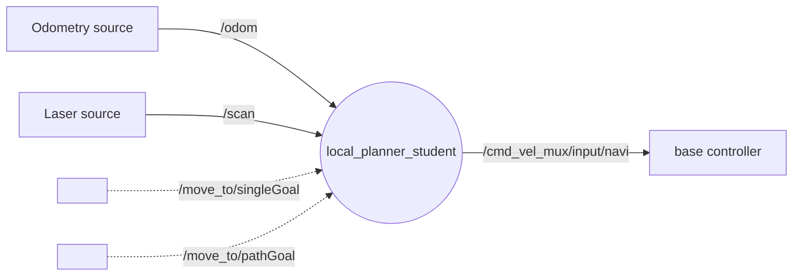
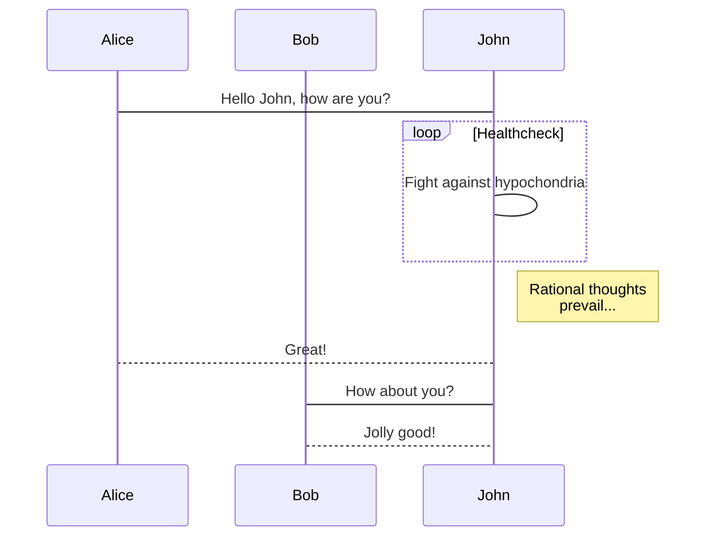

auteurs : 

# Listes des fonctionnalités :

1. [x] RO
2. [ ] Incomplete features
    1. [ ] Sub-task 1
    2. [x] Sub-task 2
3. [x] ROS Navigation Stack
    1. [x] Sub-task 1
    2. [x] Sub-task 2

# Représentation des noeuds

# Description de l'algo

# Vidéos de présentation

[Lien vers la vidéo pitch youtube](url)

[Lien vers la vidéo tutoriel youtube](url)

# Liste des dépendances et pré-requis

- a
- b

# Procédure de mise en route

- a
- b
- n