# Navigation de véhicules en milieu urbain

auteurs : Idwes Sough, Arthur Saunier, Younes Abouchi

## Objectifs
Faire naviguer des véhicules (Turtlebot + [Limo](https://global.agilex.ai/products/limo)) dans un environnement urbain (route, feu, piétons, signalisation, ...) en respectant sa réglementation (laisser)  

## Introduction
Le projet consiste à faire naviguer un véhicule dans un environnement urbain. Le véhicule devra respecter les règles de circulation et les règles de priorité. Il devra également être capable de détecter les panneaux de signalisation et les feux tricolores.[copil]

Les moyens mis en place pour atteindre cet objectif sont les suivants :
- Un véhicule mobile équipé [Limo](https://global.agilex.ai/products/limo) (voir [ici](https://global.agilex.ai/products/limo) pour plus d'informations)
- Un ordinateur de DeepLearning (CUDA GPU) pour l'entraînement du réseau de neurones ainsi que ces inférences durant toute la durée de la navigation du robot autonome.
  
Le Limo est compatible avec le grand framework de robotique ROS (Robot Operating System) et sa montée de version ROS2, l'objectif est de piloter ce robot Limo de la marque Agilex au sein d'une map de type Smart City comme illustré ci-dessous :
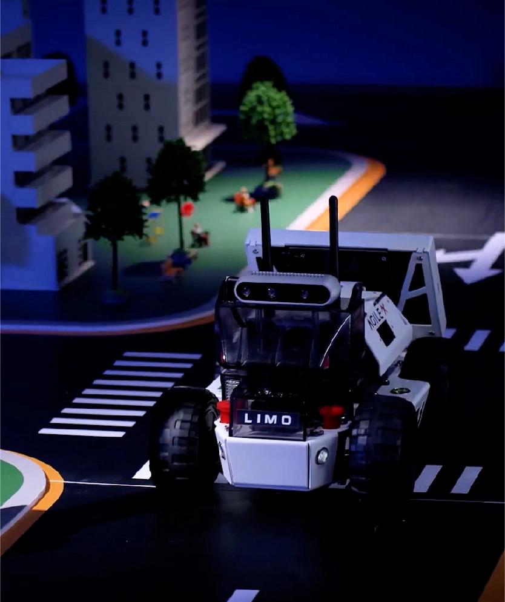

Le Limo est compatible ROS2 avec les différentes caractéristiques hardware suivantes :
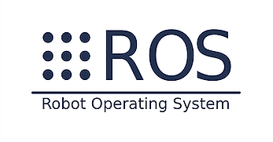
lower size of image

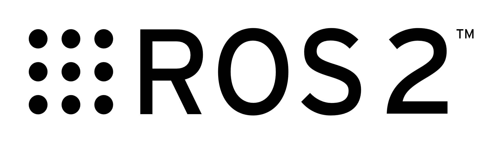
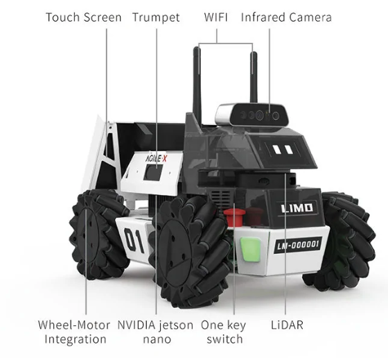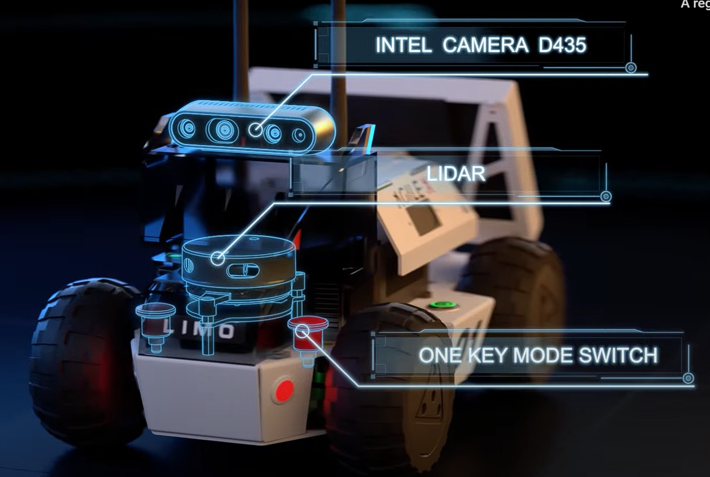
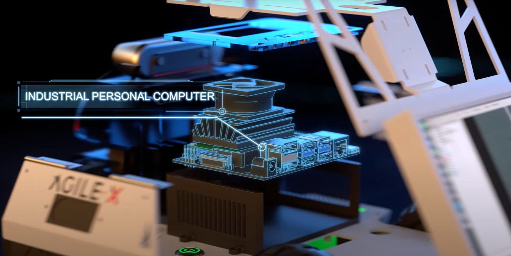
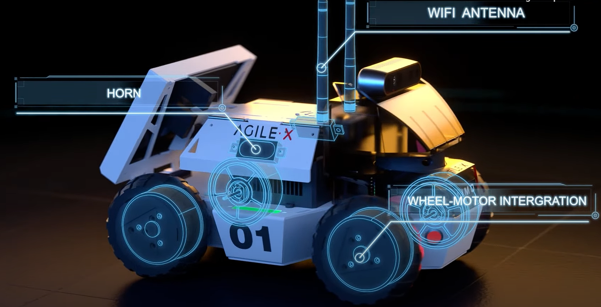
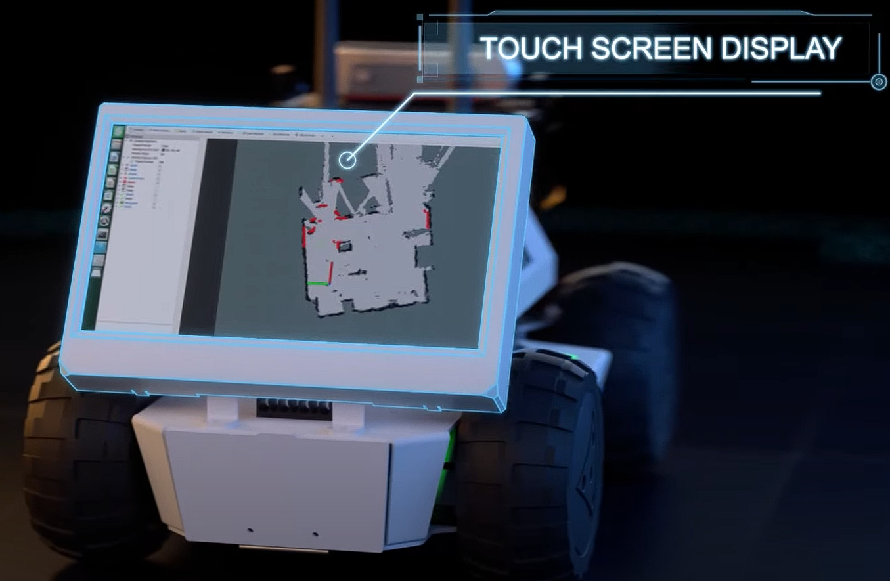

## Fonctionnalités spécifique au projet :
- Fonctionnelles :
  - Un réseau de neurone dont les inférences tournent sur GPU CUDA (configuré pour RTX 2070 Super et RTX 3090?):
    - Classe requises :
      - Tous les panneaux fournis (jouets)
      - Tous les personnages fournis (jouets)
      - Signalisation lumineuse (état des feux tricolores)
      - Objets sensibles (poussette chien)
  - Un noeud ROS avec :
    - en entrée : un flux vidéo (caméra)
    - un traitement pour définir le déplacement du robot:
      - Réseau de neurone
      - Post-traitement, par exemple l'état du feu (roue, vert, orange)
    - en sortie : à minima une commande en vélocité du robot, mais idéalement un client d'action lié à la couche de navigation du robot 

La solution dockerisée devra pouvoir tourner indépendamment sur un Agilex Limo (sur Jetson Nano à 5FPS ou 7FPS ou à 37FPS sur un PC Predator (RTX 2070 Super & i7 10th) voir 120FPS avec 2 RTX 3090 en SLI)  

Le projet nécessite de maquetter une route, en collaboration avec un autre projet de Smart City consistant à la synchronisation de feux tricolores de signalisation lumineuse par le biai d'une LED par couleur à detecter et prendre en compte dans la conduite autonome.

## Listes des fonctionnalités :

1. Un conteneur docker contenant :
    1. [x] Un réseau de neurone YOLO/Darknet
        1. [x] Reconnaissance panneaux
        2. [x] Reconnaissance personnage
        3. [x] Reconnaissance signalisation lumineuse de feux tricolores
        4. [x] Reconnaissance d'objets hautement sensibles (ex poussette)
    2. [x] ROS nodes
        1. [x] Flux vidéos en entrée (rgb depth)
        2. [x] YOLO Darknet
        3. [x] Post-traitement
        4. [x] Line follower
    3. [x] Docker
        1. [x] Docker ROS2 PC
        2. [x] Docker ROS1 PC
        3. [ ] Docker Reseau
        4. [x] Docker Limo ROS2
        5. [ ] Docker Limo ROS1
        6. [ ] Launch global via docker-compose

## Technologies
* ROS
* Python
* darknet/TF
* Docker

# SPRINT 1

Labélisation des images pour entraînement du réseau de neurones YOLO/Darknet avec Dataset personnalisé (panneaux, personnages, feux tricolores, objets sensibles) liés à la Smart City du use case.

Choix de Yolo/Darknet car c'est un réseau de neurones très performant et rapide pour la détection d'objets étant également open source et implémentable dans le framework ROS. Les ajustements de paramètres du réseau de neurones sont réalisés sur un PC avec GPU CUDA (RTX 2070 Super) et les inférences sont réalisées sur un Limo avec GPU CUDA (Jetson Nano) dans un premier temps.

## Installation de Darknet

### Installation de CUDA

```bash
sudo apt-get install nvidia-cuda-toolkit
```
(Bien vérifier la disponibilité et la compatibilité de version CUDA avec votre GPU https://developer.nvidia.com/cuda-downloads)


## Demo avec camera pc

./darknet detector demo YOLOV3_YCB_tiny/ycb.data YOLOV3_YCB_tiny/yolov3-tiny-traffic.cfg YOLOV3_YCB_tiny/backup/yolov3-tiny-traffic.weights

## On Limo:
- Lancer ``roscore``
- Lancer LIDAR
``roslaunch limo_bringup limo_start.launch pub_odom_tf:=false``
- Lancer caméra
``roslaunch astra_camera dabai_u3.launch``
- lancer nav (après avoir mapper l'environnement)
``roslaunch limo_bringup limo_navigation_ackerman.launch``

- Lancer ROSCore de Limo
``rosrun web_video_server web_video_server``

- Vérifier la présence de Topic suivant avec : 

``rostopic list``
`` /camera/rgb/image_raw``
``/camera/depth/image_raw``
``rostopic echo /camera/depth/camera_info`` (pour vérifier la bonne récéption des données de profondeur)

- modifier CUDA version dans MakeFile 
``NVCC=/usr/local/cuda-11.8/bin/nvcc``

./darknet detector demo YOLOV3_YCB_tiny/ycb.data YOLOV3_YCB_tiny/yolov3-tiny-traffic.cfg YOLOV3_YCB_tiny/backup/yolov3-tiny-traffic.weights http://localhost:8080/stream?topic=/camera/rgb/image_raw``

# SPRINT 2

## Noeuds ROS:

### Noeud nav_limo

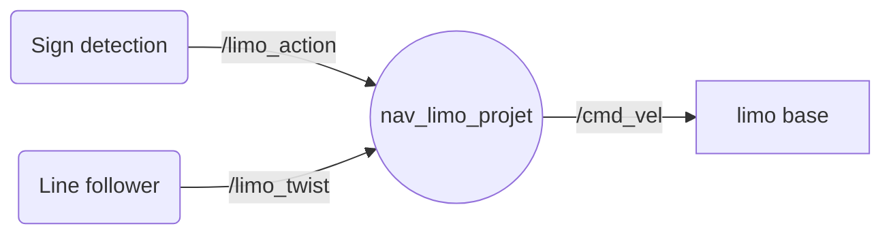

### Noeud Line_follower

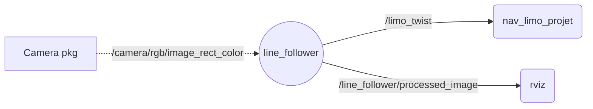

### Noeud Sign_detection

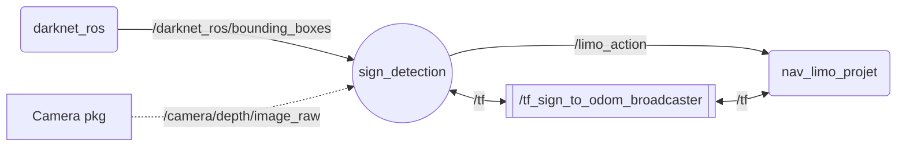

## Description algo state machine

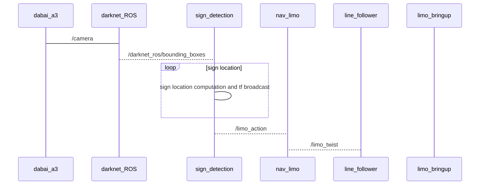


 # Description de l'algo

 


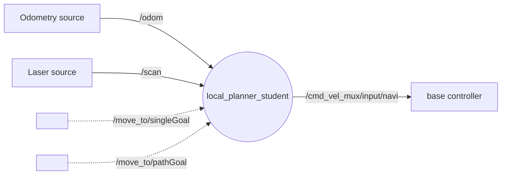

# Liste des dépendances et pré-requis

- Package ROS-darknet [lien](https://github.com/leggedrobotics/darknet_ros)
- Package Limo ROS1 [lien](https://github.com/agilexrobotics/limo_ros)
- Package Limo ROS2 [lien](https://github.com/agilexrobotics/limo_ros2)

# Procédure de mise en route

Suivre ce [lien](ROS1/ROS1_ws/README.md)

# Liens vidéos
- [lien vidéo tuto](https://drive.google.com/file/d/1eBB9-hhdBYfWyYRdyZxVa7c_rNDUIWgx/view?usp=share_link)
- [lien vidéo démo]()