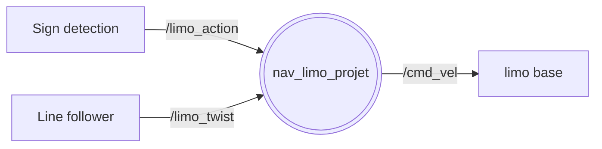
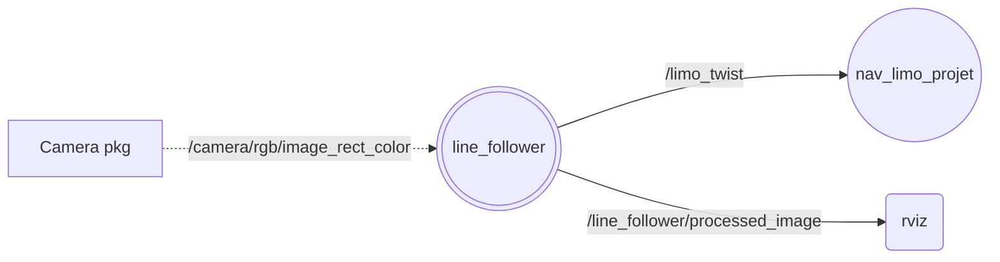
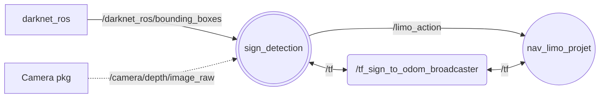
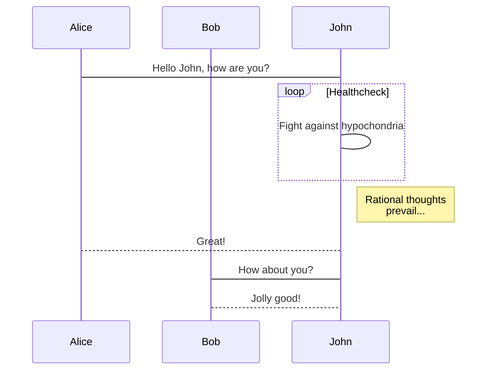

# Navigation de véhicules en milieu urbain

auteurs : Idwes Sough, Arthur Saunier, Younes Abouchi

## Objectifs
Faire naviguer des véhicules (Turtlebot + [Limo](https://global.agilex.ai/products/limo)) dans un environnement urbain (route, feu, piétons, signalisation, ...) en respectant sa réglementation (laisser) 

## Fonctionnalités spécifique au projet :
- Fonctionnelles :
  - Un réseau de neurone dont les inférences tournent sur GPU CUDA (configuré pour RTX 2070 Super et RTX 3090?):
    - Classe requises :
      - Tous les panneaux fournis (jouets)
      - Tous les personnages fournis (jouets)
      - Signalisation lumineuse (état des feux tricolores)
      - Objets sensibles (poussette chien)
  - Un noeud ROS avec :
    - en entrée : un flux vidéo (caméra)
    - un traitement pour définir le déplacement du robot:
      - Réseau de neurone
      - Post-traitement, par exemple l'état du feu (roue, vert, orange)
    - en sortie : à minima une commande en vélocité du robot, mais idéalement un client d'action lié à la couche de navigation du robot 

La solution dockerisée devra pouvoir tourner indépendamment sur un Agilex Limo (sur Jetson Nano à 5FPS ou 7FPS ou à 37FPS sur un PC Predator (RTX 2070 Super & i7 10th) voir 120FPS avec 2 RTX 3090 en SLI)  

Le projet nécessite de maquetter une route, en collaboration avec un autre projet de Smart City consistant à la synchronisation de feux tricolores de signalisation lumineuse par le biai d'une LED par couleur à detecter et prendre en compte dans la conduite autonome.

## Listes des fonctionnalités :

1. Un conteneur docker contenant :
    1. [x] Un réseau de neurone YOLO/Darknet
        1. [x] Reconnaissance panneaux
        2. [x] Reconnaissance personnage
        3. [x] Reconnaissance signalisation lumineuse de feux tricolores
        4. [x] Reconnaissance d'objets hautement sensibles (ex poussette)
    2. [x] ROS nodes
        1. [x] Flux vidéos en entrée (rgb depth)
        2. [x] YOLO Darknet
        3. [x] Post-traitement
        4. [x] Line follower
    3. [x] Docker
        1. [x] Docker ROS2 PC
        2. [x] Docker ROS1 PC
        3. [] Docker Reseau
        4. [x] Docker Limo ROS2
        5. [] Docker Limo ROS1

## Technologies
* ROS
* Python
* darknet/TF
* Docker

# SPRINT 1

## Demo avec camera pc

./darknet detector demo YOLOV3_YCB_tiny/ycb.data YOLOV3_YCB_tiny/yolov3-tiny-traffic.cfg YOLOV3_YCB_tiny/backup/yolov3-tiny-traffic.weights

## On Limo:
- lancer roscore
- Lancer LIDAR
roslaunch limo_bringup limo_start.launch pub_odom_tf:=false
- Lancer caméra
roslaunch astra_camera dabai_u3.launch
- lancer nav (après avoir mapper l'environnement)
roslaunch limo_bringup limo_navigation_ackerman.launch

Lancer ROSCore de Limo
rosrun web_video_server web_video_server

topic
/camera/rgb/image_raw
modifier CUDA version dans MakeFile 
NVCC=/usr/local/cuda-11.8/bin/nvcc
./darknet detector demo YOLOV3_YCB_tiny/ycb.data YOLOV3_YCB_tiny/yolov3-tiny-traffic.cfg YOLOV3_YCB_tiny/backup/yolov3-tiny-traffic.weights http://localhost:8080/stream?topic=/camera/rgb/image_raw

# SPRINT 2

## Noeuds ROS:

### Noeud nav_limo

### Noeud Line_follower

### Noeud Line_follower

# Description de l'algo

 # Description de l'algo

sequenceDiagram
    participant Alice
    participant Bob
    Alice->John: Hello John, how are you?
    loop Healthcheck
        John->John: Fight against hypochondria
    end
    Note right of John: Rational thoughts  prevail...
    John-->Alice: Great!
    John->Bob: How about you?
    Bob-->John: Jolly good!

graph LR
    T1[Odometry source] -- /odom --> Node((local_planner_student))
    T2[Laser source] -- /scan --> Node((local_planner_student))

    S1[ ] -. /move_to/singleGoal .-> Node
    S2[ ] -. /move_to/pathGoal .-> Node

    Node -- /cmd_vel_mux/input/navi -->D[base controller]

# Liste des dépendances et pré-requis

- Package ROS-darknet [lien](https://github.com/leggedrobotics/darknet_ros)
- Package Limo ROS1 [lien](https://github.com/agilexrobotics/limo_ros)
- Package Limo ROS2 [lien](https://github.com/agilexrobotics/limo_ros2)

# Procédure de mise en route

Suivre ce [lien](ROS1/ROS1_ws/README.md)