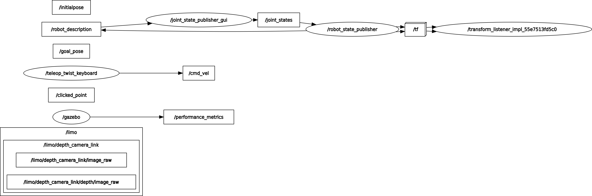

# Commande utiles pour ROS et ROS 2

Pour sourcer les commande ROS (a faire a chaque nouveau shell)
> source /opt/ros/humble/setup.bash

ROS domain ID choisi sur PC:
>42

Bien installer colcon pour build les packages:
>sudo apt install python3-colcon-common-extensions

sourcer ROS2 install apres build:
>source ./install/local_setup.bash

ou

>source /opt/ros/humble/setup.bash

Lien git du repo fonctionnant sur ROS2 humble
https://github.com/P1NHE4D/limo_ros2_humble

doc limo:
https://github.com/agilexrobotics/limo-doc/blob/master/Limo%20user%20manual(EN).md

Package a installer en plus:
- joint-state-publisher-gui
- Gazebo-ros
- xacro

## Rqt_graph initial pour etudier les connexions inter nodes:

On voit que sur le mode simu, on a aucune connexion avec le topic /cmd_vel

En gros, rien n'es li avec /cmd_vel, du coup la teleop ne fonctionne pas. Il y a tout un pan de code a realiser via le package limo_base pour gerer la teleop et piloter le limo en simulation>

Correction sur fichier gazebo urdf. a etudier plus longuement.

Choix de passer en physique, on reviendra sur la simu plus tard si le temps le permet.