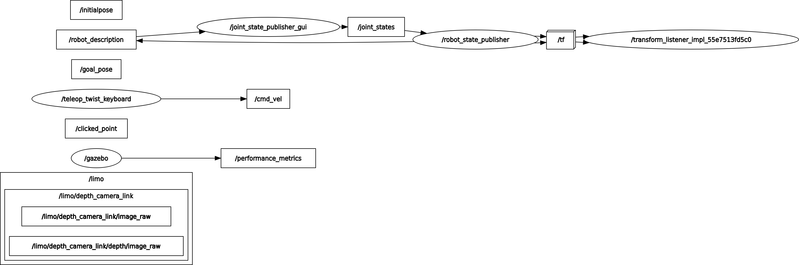

# Commande utiles pour ROS et ROS 2

Pour sourcer les commande ROS (a faire a chaque nouveau shell)
> source /opt/ros/foxy/setup.bash

ROS domain ID choisi sur PC:
>228

Bien installer colcon pour build les packages:
>sudo apt install python3-colcon-common-extensions

sourcer ROS2 install apres build:
>source ./install/local_setup.bash

ou

>source /opt/ros/foxy/setup.bash

Lien git du repo fonctionnant sur ROS2 humble
https://github.com/P1NHE4D/limo_ros2_humble

doc limo:
https://github.com/agilexrobotics/limo-doc/blob/master/Limo%20user%20manual(EN).md

Package a installer en plus:
- joint-state-publisher-gui
- Gazebo-ros
- xacro

## Rqt_graph initial pour etudier les connexions inter nodes:

On voit que sur le mode simu, on a aucune connexion avec le topic /cmd_vel

En gros, rien n'es li avec /cmd_vel, du coup la teleop ne fonctionne pas. Il y a tout un pan de code a realiser via le package limo_base pour gerer la teleop et piloter le limo en simulation>

Correction sur fichier gazebo urdf. a etudier plus longuement. (probable probleme de ros2 et compatibilite limo)

Choix de passer en physique, on reviendra sur la simu plus tard si le temps le permet.

test en ros1 (melodic) concluant. possibilite de mapping, navigation et teleop.

lien pour installer ros2 eloquent sur limo:

https://github.com/agilexrobotics/limo_ros2/tree/humble/docs

lien doc:

https://github.com/agilexrobotics/limo-doc/blob/master/Limo%20user%20manual(EN).md

passage sous ros1 pour sprint 1, ros2 pour sprint 2.

# SPRINT 2:

https://husarion.com/tutorials/ros2-tutorials/rosbot-ros2-demo-docker/
https://github.com/NVIDIA/nvidia-docker

## Docker:
X11 docker blog pour construire le docker sur PC ([lien](https://jaydenm.com/blog/docker-x11-desktop/))

Atttention sur ros2, bien mettre ROS_DOMAIN_ID=228 avec le meme ID sur tout les conteneur

### Connection docker ros2:

Lancer docker compose:
>docker compose up

Dans un autre terminal:
>ssh -Y user@localhost

mdp:
>password
