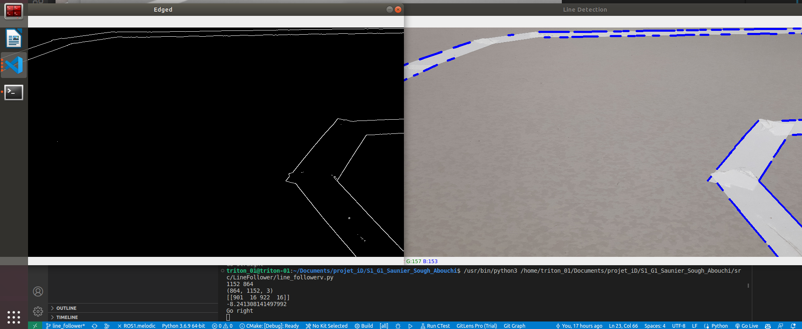
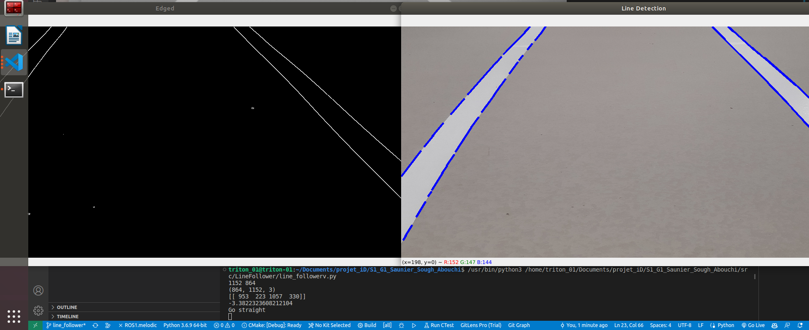

# ROAD FOLLOWER

When the algorithm has a road that turn right on input :

We can see on the terminal that theta angle is calculated and decision is taking from this value compared to a threshold.

Same thing with straight road :
